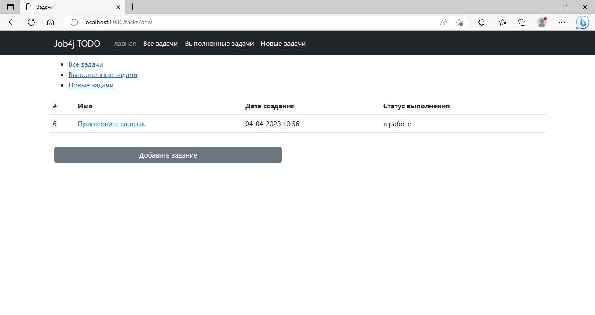

В этом учебном приложении необходимо создать приложение "TODO список".

## Стек технологий
- **Java 17**
- **Spring Boot 2.7.6**
- **Maven 3.8**
- **Git**
- **PostgreSQL 14**
- **Thymeleaf**
- **Bootstrap 5.2.3**
- **Liquibase 4.15.0**
- **sql2o 1.6.0**
- **H2 1.4.2**
- **Mockito 4.8.0**
- **Lombok 1.18.22**
- **Hibernate 5.6.11**

## Требования к окружению

- **Java 17**
- **Maven 3.8**
- **PostgreSQL 14**

## Сборка и запуск<br>

**Cоздать базу данных**

 ``` shell 
create database todo;
```
- **Запустить проект по команде**
-
``` shell 
mvn spring-boot:run
```

## Взаимодействие с приложением.

На главной странице выведена общая информация о ресурсе.


На странице выведен список всех задач.
Для добавления новой задачи необходимо выбрать "Добавить задачу"


Страница с добавлением новой задачи.
При добавлении новой задачи статус задачи будет "в работе"


Чтобы получить информацию о задаче, необходимо перейти на его страницу.
Здесь можно выбрать выполнение задачи, редактирование или удаление


При переходе на страницу выводится список всех задач в работе.


При переходе на страницу выводится список всех новых задач.


Отображение страницы при отсутствии задач той или иной группы


## Контакты для связи<br>
> Связаться со мной [TELEGRAM](https://t.me/AlekseyNovoselov/).